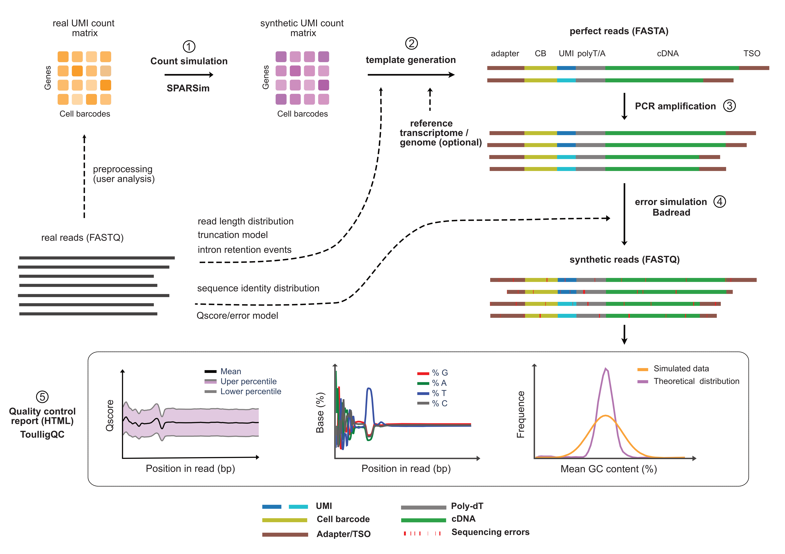
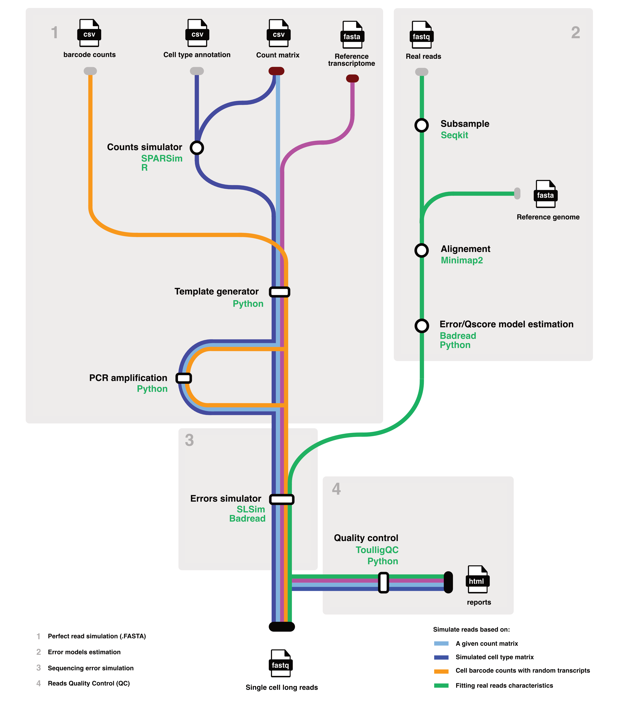

[](https://github.com/GenomiqueENS/AsaruSim/releases)
[](https://pkg.go.dev/Nextflow)
[](https://www.docker.com/ "Go to Docker homepage")


[](https://doi.org/10.1101/2024.09.20.613625)
[](https://twitter.com/Genomique_ENS)

# Asaru Sim Documentation
<a href="images/asarusim_v2.svg">

`AsaruSim` is an automated Nextflow workflow designed for simulating 10x single-cell Nanopore reads. This workflow aims to generate a gold standard dataset for the objective assessment and optimization of single-cell long-read methods.
Full [documentation](https://GenomiqueENS.github.io/AsaruSim/) is avialable [here](https://GenomiqueENS.github.io/AsaruSim/).

<a href="images/schema.png">
## Prerequisites


Before starting, ensure the following tools are installed and properly set up on your system:

- **Nextflow >= v24.04.4**: A workflow engine for complex data pipelines. [Installation guide for Nextflow](https://www.nextflow.io/docs/latest/getstarted.html).
- **Docker** or **Singularity**: Containers for packaging necessary software, ensuring reproducibility. [Docker installation guide](https://docs.docker.com/get-docker/), [Singularity installation guide](https://sylabs.io/guides/3.0/user-guide/installation.html).
- **Git**: Required to clone the workflow repository. [Git installation guide](https://git-scm.com/book/en/v2/Getting-Started-Installing-Git).

## Installation

Clone the `AsaruSim` GitHub repository:

```bash
git clone https://github.com/alihamraoui/AsaruSim.git
cd AsaruSim
```

## Test
To test your installation, we provide an automated script to download reference annotations and simulate a subset of human PBMC dataset `run_test.sh`.

```bash
bash run_test.sh
```

## Configuration

Customize runs by editing the `nextflow.config` file and/or specifying parameters at the command line.

### Pipeline Input Parameters

Here are the primary input parameters for configuring the workflow:

| Parameter          | Description                                                   | Default Value                                 |
|--------------------|---------------------------------------------------------------|-----------------------------------------------|
| `matrix`           | Path to the count matrix csv file (required)                  | `test_data/matrix.csv`                        |
| `bc_counts`        | Path to the barcode count file                                | `test_data/test_bc.csv`                       |
| `transcriptome`    | Path to the reference transcriptome file (required)           | `test_data/transcriptome.fa`                  |
| `features`         | Matrix feature counts                                         | `transcript_id`                               |
| `gtf`              | Path to transcriptom annotation .gtf file                     | `null`                                        |
| `cell_types_annotation`    | Path to cell type annotation .csv file                | `null`                                        |

### Error/Qscore Parameters

Configuration for error model:

| Parameter          | Description                                                   | Default Value                                 |
|--------------------|---------------------------------------------------------------|-----------------------------------------------|
| `trained_model`    | Badread pre-trained error/Qscore model name                   | `nanopore2023`                                |
| `badread_identity` | Comma-separated values for Badread identity parameters        | `"98,2,99"`                                   |
| `error_model`      | Custom error model file (optional)                            | `null`                                        |
| `qscore_model`     | Custom Q-score model file (optional)                          | `null`                                        |
| `build_model`      | to build your own error/Qscor model                           | `false`                                       |
| `fastq_model`      | reference real read (.fastq) to train error model   (optional)      | `false`                                       |
| `ref_genome`       | reference genome .fasta file (optional)                       | `false`                                       |

### Additional Parameters

| Parameter          | Description                                                   | Default Value                                 |
|--------------------|---------------------------------------------------------------|-----------------------------------------------|
| `amp`              | Amplification factor                                          | `1`                                           |
| `outdir`           | Output directory for results                                  | `"results"`                                   |
| `projectName`      | Name of the project                                           | `"test_project"`                              |

### Run Parameters

Configuration for running the workflow:

| Parameter         | Description                        | Default Value             |
|-------------------|------------------------------------|---------------------------|
| `threads`         | Number of threads to use           | `4`                       |
| `container`       | Docker container for the workflow  | `'hamraouii/wf-SLSim'`    |
| `docker.runOptions` | Docker run options to use       | `'-u $(id -u):$(id -g)'`  |

## Usage
User can choose among 4 ways to simulate template reads.
- use a real count matrix
- estimated the parameter from a real count matrix to simulate synthetic count matrix 
- specified by his/her own the input parameter
- a combination of the above options

We use SPARSIM tools to simulate count matrix. for more information a bout synthetic count matrix, please read [SPARSIM](https://gitlab.com/sysbiobig/sparsim/-/blob/master/vignettes/sparsim.Rmd?ref_type=heads#Sec_Input_parameter_estimated_from_data) documentaion.

### EXAMPLES 
##### Sample data
A demonstration dataset to initiate this workflow is accessible on zenodo DOI : [10.5281/zenodo.12731408](https://zenodo.org/records/12731409). This dataset is a subsample from a Nanopore run of the [10X 5k human pbmcs](https://www.10xgenomics.com/datasets/5k-human-pbmcs-3-v3-1-chromium-controller-3-1-standard).

The human GRCh38 [reference transcriptome](https://ftp.ensembl.org/pub/release-112/fasta/homo_sapiens/cdna/), [gtf annotation](https://ftp.ensembl.org/pub/release-112/gtf/homo_sapiens/) and [fasta referance genome](https://ftp.ensembl.org/pub/release-112/fasta/homo_sapiens/dna/) can be downloaded from Ensembl.


You can use the `run_test.sh` script to automatically download all required datasets.

##### BASIC WORKFLOW

```bash
 nextflow run main.nf --matrix dataset/sub_pbmc_matrice.csv \
                      --transcriptome dataset/Homo_sapiens.GRCh38.cdna.all.fa \
                      --features gene_name \
                      --gtf dataset/GRCh38-2020-A-genes.gtf
```

##### WITH PCR AMPLIFICTION

```bash
 nextflow run main.nf --matrix dataset/sub_pbmc_matrice.csv \
                      --transcriptome dataset/Homo_sapiens.GRCh38.cdna.all.fa \
                      --features gene_name \
                      --gtf dataset/GRCh38-2020-A-genes.gtf \
                      --pcr_cycles 2 \
                      --pcr_dup_rate 0.7 \
                      --pcr_error_rate 0.00003
```

##### WITH SIMULATED CELL TYPE COUNTS

```bash
 nextflow run main.nf --matrix dataset/sub_pbmc_matrice.csv \
                      --transcriptome dataset/Homo_sapiens.GRCh38.cdna.all.fa \
                      --features gene_name \
                      --gtf dataset/GRCh38-2020-A-genes.gtf \
                      --sim_celltypes true \
                      --cell_types_annotation dataset/sub_pbmc_cell_type.csv
```

##### USING A SPARSIM PRESET MATRIX (e.g Chu et al. 10X Genomics datasets)

```bash
nextflow run main.nf --matrix Chu_param_preset \
                      --transcriptome datasets/Homo_sapiens.GRCh38.cdna.all.fa \
                      --features gene_name \
                      --gtf datasets/Homo_sapiens.GRCh38.112.gtf
```

##### WITH PERSONALIZED ERROR MODEL

```bash
nextflow run main.nf --matrix dataset/sub_pbmc_matrice.csv \
                     --transcriptome dataset/Homo_sapiens.GRCh38.cdna.all.fa \
                     --features gene_name \
                     --gtf dataset/GRCh38-2020-A-genes.gtf \
                     --build_model true \
                     --fastq_model dataset/sub_pbmc_reads.fq \
                     --ref_genome dataset/GRCh38-2020-A-genome.fa 
```

##### COMPLETE WORKFLOW

```bash
 nextflow run main.nf --matrix dataset/sub_pbmc_matrice.csv \
                      --transcriptome dataset/Homo_sapiens.GRCh38.cdna.all.fa \
                      --features gene_name \
                      --gtf dataset/GRCh38-2020-A-genes.gtf \
                      --sim_celltypes true \
                      --cell_types_annotation dataset/sub_pbmc_cell_type.csv \
                      --build_model true \
                      --fastq_model dataset/sub_pbmc_reads.fq \
                      --ref_genome dataset/GRCh38-2020-A-genome.fa \
                      --pcr_cycles 2 \
                      --pcr_dup_rate 0.7 \
                      --pcr_error_rate 0.00003
```

## Results

After execution, results will be available in the specified `--outdir`. This includes simulated Nanopore reads `.fastq`, along with log files and QC report.

## Cleaning Up

To clean up temporary files generated by Nextflow:

```bash
nextflow clean -f
```

## Workflow


## Acknowledgements

- We would like to express our gratitude to [Youyupei](https://github.com/youyupei) for the development of [SLSim](https://github.com/youyupei/SLSim), which has been helpful to the `AsaruSim` workflow.
- Additionally, our thanks go to the teams behind [Badread](https://github.com/rrwick/Badread) and [SPARSim](https://gitlab.com/sysbiobig/sparsim), whose tools are integral to the `AsaruSim` workflow.

## Support and Contributions

For support, please open an issue in the repository's "Issues" section. Contributions via Pull Requests are welcome. Follow the contribution guidelines specified in `CONTRIBUTING.md`.

## License

`AsaruSim` is distributed under a specific license. Check the `LICENSE` file in the GitHub repository for details.

## Citation
If you use AsaruSim in your research, please cite this manuscript:<br>
> Ali Hamraoui, Laurent Jourdren and Morgane Thomas-Chollier. AsaruSim: a single-cell and spatial RNA-Seq Nanopore long-reads simulation workflow. bioRxiv 2024.09.20.613625; doi: https://doi.org/10.1101/2024.09.20.613625 

