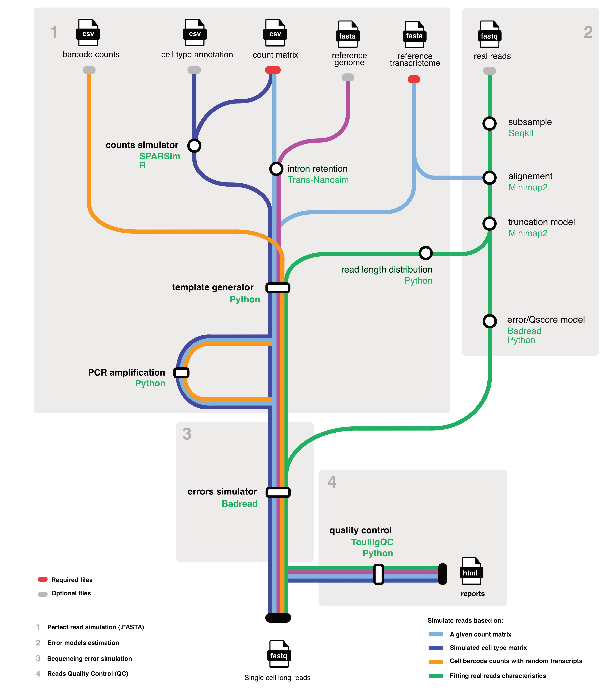

[](https://www.docker.com/ "Go to Docker homepage")
[](https://pkg.go.dev/Nextflow)
[](https://github.com/alihamraoui/AsaruSim/releases/)

[](https://github.com/alihamraoui/AsaruSim/issues)
[](https://twitter.com/Genomique_ENS)

# Asaru Sim Documentation

`AsaruSim` is an automated Nextflow workflow designed for simulating 10x single-cell Nanopore reads. It allows to benchmark and optimize single-cell Nanopore long read data processing pipelines.



## Prerequisites

Before starting, ensure the following tools are installed and properly set up on your system:

- **Nextflow**: A workflow engine for complex data pipelines. [Installation guide for Nextflow](https://www.nextflow.io/docs/latest/getstarted.html).
- **Docker** or **Singularity**: Containers for packaging necessary software, ensuring reproducibility. [Docker installation guide](https://docs.docker.com/get-docker/), [Singularity installation guide](https://sylabs.io/guides/3.0/user-guide/installation.html).
- **Git**: Required to clone the workflow repository. [Git installation guide](https://git-scm.com/book/en/v2/Getting-Started-Installing-Git).

## Installation

Clone the `AsaruSim` GitHub repository:

```bash
git clone https://github.com/alihamraoui/AsaruSim.git
cd AsaruSim
```

## Configuration

Customize runs by editing the `nextflow.config` file and/or specifying parameters at the command line.

### Pipeline Input Parameters

Here are the primary input parameters for configuring the workflow:

| Parameter          | Description                                                   | Default Value                                 |
|--------------------|---------------------------------------------------------------|-----------------------------------------------|
| `barcodes`         | Path to the barcode count file                                | `test_data/test_bc.tsv`                       |
| `transcriptome`    | Path to the transcriptome file                                | `test_data/transcriptome.fa`                  |
| `ref_distribution` | Path to the reference reads length fastq file (optional)      | `null`                                        |
| `amp`              | Amplification factor                                          | `2`                                           |
| `error_model`      | Custom error model file (optional)                            | `null`                                        |
| `qscore_model`     | Custom Q-score model file (optional)                          | `null`                                        |
| `badread_identity` | Comma-separated values for Badread identity parameters        | `"98,2,99"`                                   |
| `outdir`           | Output directory for results                                  | `"results"`                                   |
| `projectName`      | Name of the project                                           | `"test_project"`                              |

### Run Parameters

Configuration for running the workflow:

| Parameter         | Description                        | Default Value             |
|-------------------|------------------------------------|---------------------------|
| `threads`         | Number of threads to use           | `4`                       |
| `container`       | Docker container for the workflow  | `'hamraouii/wf-SLSim'`    |
| `docker.runOptions` | Docker run options to use       | `'-u $(id -u):$(id -g)'`  |

## Execution

To run the workflow with your customized parameters:

```bash
nextflow run main.nf --param1 value1 --param2 value2 ...
```

Replace `--param1 value1 --param2 value2 ...` with your desired parameters.

## Results

After execution, results will be available in the specified `--outdir`. This includes simulated Nanopore reads for single-cell 10x data, along with log files and reports for further analysis.

## Cleaning Up

To clean up temporary files generated by Nextflow:

```bash
nextflow clean -f
```
## Acknowledgements

- We would like to express our gratitude to [Youyupei](https://github.com/youyupei) for the development of [SLSim](https://github.com/youyupei/SLSim), which has been foundational to the `AsaruSim` workflow.
- Additionally, our thanks go to the teams behind [Badread](https://github.com/rrwick/Badread) and [SPARSim](https://gitlab.com/sysbiobig/sparsim), whose tools are integral to the `AsaruSim` workflow.

## Support and Contributions

For support, please open an issue in the repository's "Issues" section. Contributions via Pull Requests are welcome. Follow the contribution guidelines specified in `CONTRIBUTING.md`.

## License

`AsaruSim` is distributed under a specific license. Check the `LICENSE` file in the GitHub repository for details.
